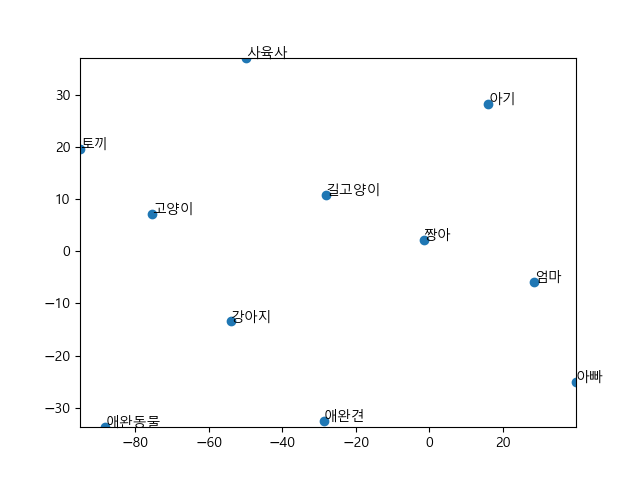

### KoWordEmbedding

This tool creates a Korean word embedding model using Word2Vec and visualizes the relationships between Korean words by displaying a t-SNE scatter plot of words similar to a selected Korean word. Enter a word, and the tool generates a visual map of semantically related words, allowing users to explore the nuanced connections and clustering of similar terms in a two-dimensional space. This visualization is useful for linguistic analysis, research in natural language processing, or simply gaining insights into word similarities and semantic structures in the Korean language.

## Usage

#### 1. Activate a virtual environment and make sure the dependencies from `requirements.txt` are installed:

```bash
# generate a venv
python3 -m venv .venv

# activate the venv (Powershell)
.\.venv\Scripts\activate.ps1
# activate the venv (Linux/macOS)
source .venv/Scripts/activate

# install the Python dependencies
pip install -r requirements.txt
```

#### 2. Download and parse wikipedia dump which is used for training word embedding

```bash
# download wikipedia data
wget https://dumps.wikimedia.org/kowiki/latest/kowiki-latest-pages-articles.xml.bz2

# parse wikipedia dump
python -m wikiextractor.WikiExtractor kowiki-latest-pages-articles.xml.bz2
```

#### 3. Run the python programs in the following order:

```bash
# go through all text files in "./text" recursively and merge them to one text file "wiki.txt"
python merge_file.py

# tokenize all data in wiki.txt using kiwi tokenizer and save them to json files in "./wiki_morphs"
python ko_tokenize.py

# create a word embedding model using Word2Vec and save the model for later use
python word_embedding_model.py
```

#### 4. Now simply run the program as follows:

```
python main.py <word> [size]
```

### Examples

```
python main.py 강아지 100
```



```
python main.py cat
```


